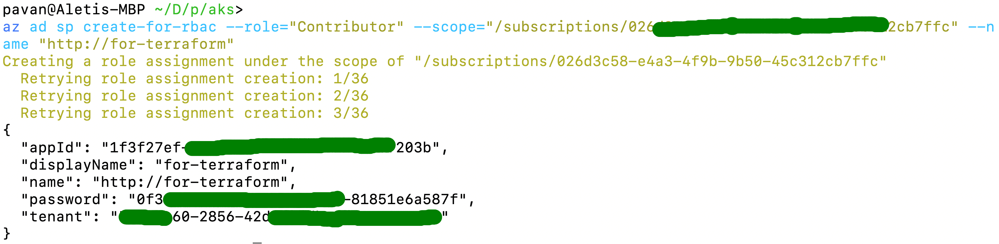
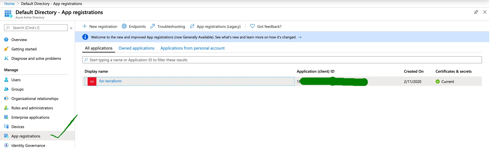
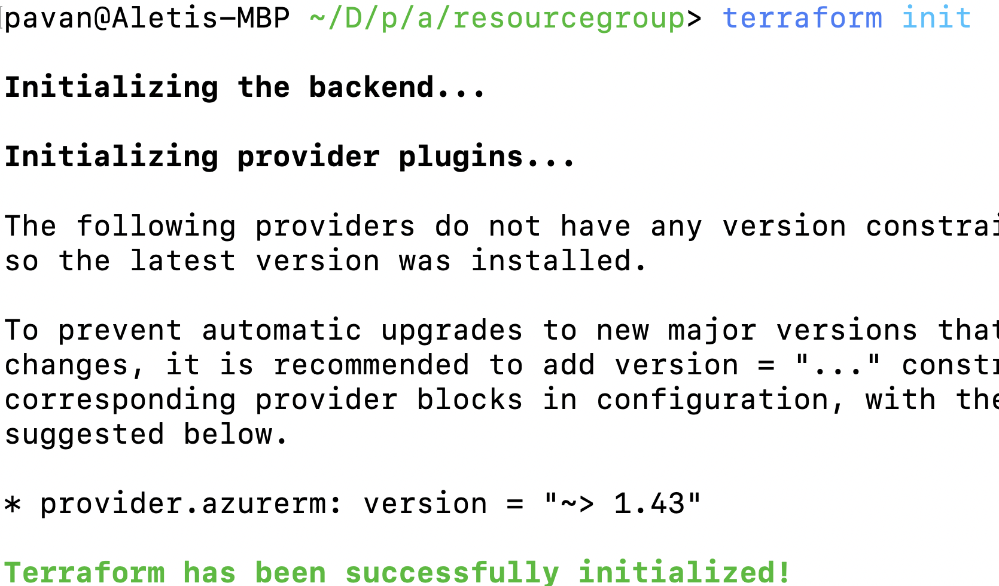
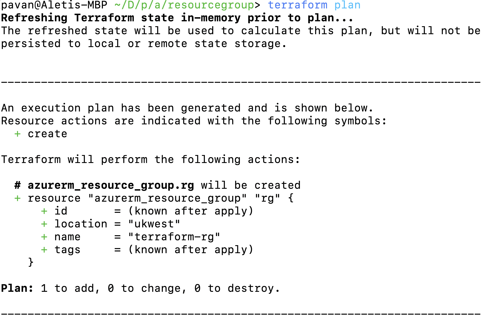
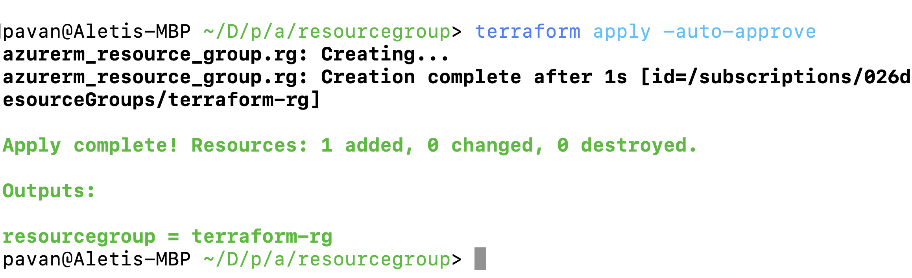
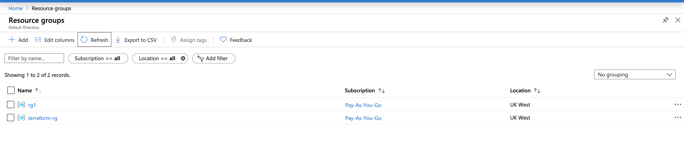

# aks
This will have steps to create Azure kubernetes cluster

We'll be using __terraform__ to provision aks cluster in __Azure__.


## Steps to Create AKS Cluster.

1. Set up Terraform Acess to Azure.

2. Create terraform configuration.

3. Create aks clusteer

4. Access AKS cluster.


### Set up Terraform Access to Azure.

We need an azure ad service principal in order to access terraform, so let's create one. Please install [`az cli`](https://www.youtube.com/watch?v=FdsDtfo8xQY&t=2s) in your laptop.

```
# Login to your azure account.
$ az login

# set scope to appropriate subscription
$ az account set -s <subscriptionId>

# create azure ad service principal, Save the output of this command. 
$ az ad sp create-for-rbac --role="Contributor" --scope="/subscriptions/<subsriptionId>"

```
When run you will get __appId, password__, please make note of these.



Now, get on to __Azure Active Directory__ and select __App registrations__ you should see something like below.




### Now Create a Resource Group with Terraform.

```
# change the folder
$ cd resourcegroup

# initialise terraform
$ terraform init
```


```
# plan 
$ terraform plan
```



```
# apply 
terraform apply -auto-approve
```



### Validate the Resource Group in Azure Portal

Login into the azure portal and click on resource groups. You should see resource group like below.



